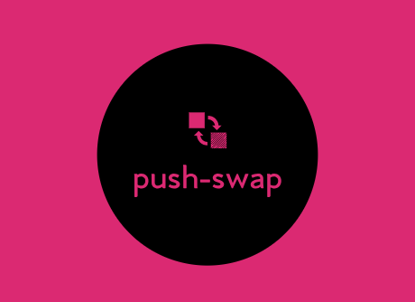

  

# wethinkcode_ Johannesburg

## push_swap

Algorithms I Project

This project aims to create a stack-sorting program `push_swap` and a checking program `checker`.

Restrictions:
<ul>
  <li> no more than 2-3 operations for 3 integers</li>
  <li> no more than 12 operations for 5 integers </li>
  <li> no more than 700 operations for 100 integers</li>
  <li> no more than 5300 operations for 500 integers</li>
</ul>

